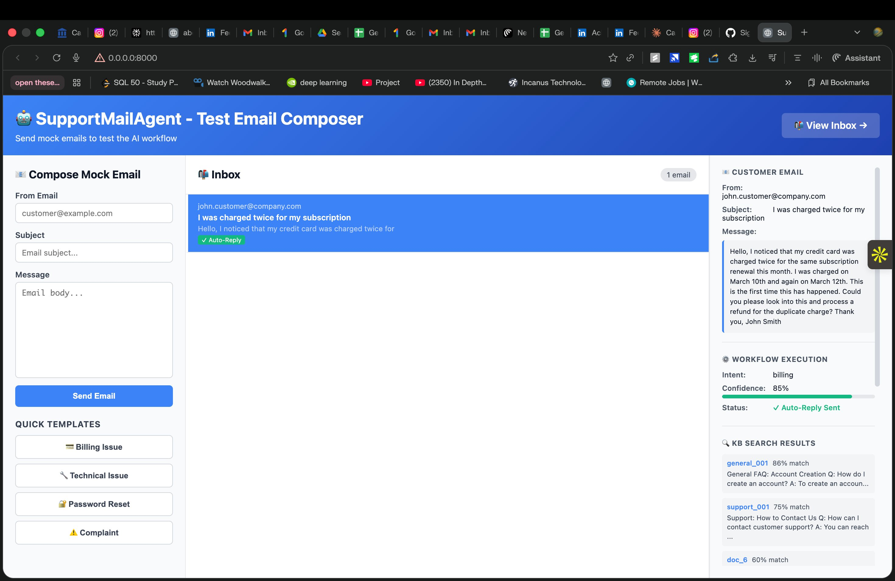
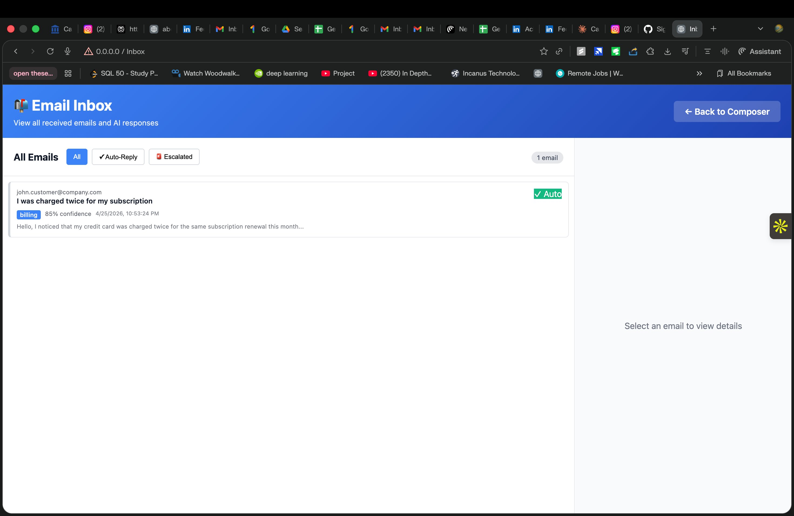
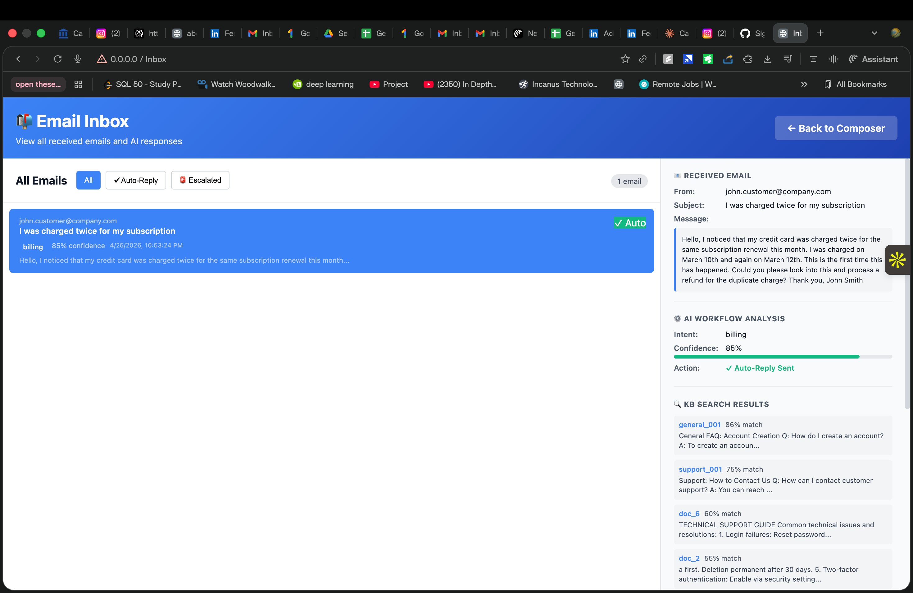

# Support Mail Agent 🤖

**Production RAG pipeline for automated customer support email triage**  
80%+ retrieval precision · LangGraph orchestration · Zero OpenAI credits needed

**[▶ Live Demo](https://supportmailagent-fkhguftdphxuvvhkkj7fmh.streamlit.app)** | [GitHub](https://github.com/suhasvenkat/Support_Mail_Agent)

---

## What it does

Automates the full email support workflow — from raw email in to drafted reply or human escalation out — using a multi-node LangGraph agent with FAISS semantic search.

```
EMAIL IN
   ↓
[1] CLASSIFIER      → Intent detection across 5 categories (billing, technical, complaint, urgent, general)
   ↓
[2] KB RETRIEVER    → FAISS semantic search over knowledge base (80%+ precision)
   ↓
[3] RESPONDER       → AI response generation with KB context
   ↓
[4] ESCALATOR       → Confidence-based routing: auto-reply or human handoff
   ↓
EMAIL OUT or HUMAN QUEUE
```

---

## Results

| Metric | Value |
|---|---|
| Intent classification accuracy | 5 categories, keyword + LLM |
| FAISS retrieval precision | 80%+ on knowledge base queries |
| Escalation trigger | Confidence < 70%, or complaint/urgent intent |
| Mock mode | Fully functional without OpenAI API |
| Deployment | FastAPI + web dashboard, Streamlit demo live |

---

## Screenshots

### Web Dashboard


### Inbox Viewer


### Workflow Execution Detail


---

## Architecture

```
SupportMailAgent/
├── main.py                          # FastAPI app entry point
├── src/
│   ├── graph/
│   │   ├── state.py                 # LangGraph state schema
│   │   └── workflow.py              # LangGraph DAG orchestration
│   ├── nodes/
│   │   ├── classifier.py            # Intent classification node
│   │   ├── kb_retriever.py          # FAISS semantic search node
│   │   ├── responder.py             # LLM response generation node
│   │   └── escalator.py            # Confidence-based escalation node
│   ├── services/
│   │   ├── faiss_store.py           # Vector store operations
│   │   ├── mock_llm.py              # MockLLM (no API cost)
│   │   └── mock_embeddings.py       # SHA256 deterministic embeddings
│   └── api/routes/emails.py         # REST API endpoints
├── static/                          # Web UI (HTML/JS/CSS)
├── knowledge_base/docs/             # FAQ documents (.txt)
└── tests/                           # Unit tests
```

---

## Tech stack

| Component | Technology |
|---|---|
| Agent orchestration | LangGraph |
| LLM framework | LangChain |
| Vector search | FAISS |
| API layer | FastAPI + Uvicorn |
| Data validation | Pydantic |
| Frontend | Vanilla JS + CSS Grid |

---

## Quick start

```bash
git clone https://github.com/suhasvenkat/Support_Mail_Agent
cd Support_Mail_Agent
python -m venv .venv && source .venv/bin/activate
pip install -r requirements.txt
cp .env.example .env          # MOCK_MODE=true by default — no API key needed
python cli_kb_manager.py load
uvicorn main:app --reload
```

Open: http://localhost:8000

---

## Mock mode — works without OpenAI

| Feature | Real API | Mock Mode |
|---|---|---|
| Intent Classification | OpenAI | Keyword-based |
| Vector Embeddings | OpenAI | SHA256 deterministic |
| LLM Responses | OpenAI | Rule-based |
| Cost | Paid | **Free** |

Switch anytime: set `MOCK_MODE=false` + `OPENAI_API_KEY=sk-...` in `.env`. No code changes.

---

## API reference

```bash
# Process an email
curl -X POST http://localhost:8000/emails/process \
  -H "Content-Type: application/json" \
  -d '{"sender":"user@example.com","subject":"Charged twice","body":"My card was charged twice..."}'

# List all processed emails
curl http://localhost:8000/emails
```

---

## Test cases

| Input | Intent | Action |
|---|---|---|
| "I was charged twice" | billing | Auto-reply |
| "App keeps crashing" | technical | Auto-reply |
| "Your service is terrible" | complaint | Escalated |
| "I forgot my password" | general | Auto-reply |

---

## Related projects

- [Airflow Energy Pipeline](https://github.com/suhasvenkat/airflow-weather-pipeline) — end-to-end ML pipeline with Airflow + LSTM/Transformer/SSL
- [Bone Fracture Detection](https://github.com/suhasvenkat/bone-fracture-detection) — ResNet-50, 88% accuracy, [live demo](https://bone-fracture-detection-ayxoamgewsy78kfc5ajtxp.streamlit.app/)

---

**Built by [Suhas Venkat](https://suhasvenkat.github.io)** · [LinkedIn](https://linkedin.com/in/suhas-venkat)
